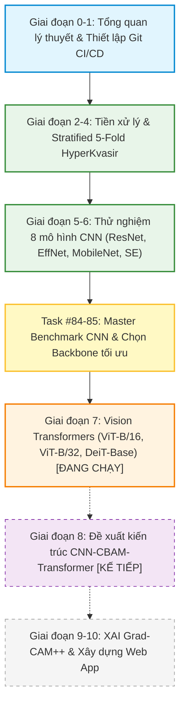

# 📋 BÁO CÁO TIẾN ĐỘ THỰC HIỆN KHÓA LUẬN TỐT NGHIỆP CỬ NHÂN
## Đề tài: Ứng dụng Học sâu trong Nhận diện và Phân loại Tổn thương Đường Tiêu hóa từ Ảnh Nội soi
**Dự án mã nguồn:** `GIEndoDL`  
**Đơn vị đào tạo:** Trường Đại học Công Thương TP.HCM (HUIT) – Khoa Công nghệ Thông tin  
**Sinh viên thực hiện:** Lê Huy Phát  
**Thời gian báo cáo:** Giai đoạn giữa kỳ (Tháng 10/2026)  

---

> [!NOTE]
> **Tóm lược tiến độ tổng quát:** Đề tài đã hoàn thành xuất sắc toàn bộ công tác chuẩn hóa dữ liệu, giải quyết mất cân bằng lớp cực đoan, và hoàn tất huấn luyện, đánh giá độc lập **8 mô hình CNN chuẩn y khoa** (Phase 6 - Tasks #76 đến #85). Đề tài hiện đang tiến hành thử nghiệm song song dòng mô hình **Vision Transformer** (Phase 7 - Tasks #86 đến #88) nhằm chuẩn bị cho kiến trúc đề xuất lai ghép cốt lõi **CNN-CBAM-Transformer**.

---

## 1. TỔNG QUAN TIẾN ĐỘ & CÁC CÔNG VIỆC ĐÃ HOÀN THÀNH

Đề tài bám sát cấu trúc kế hoạch nghiên cứu 200 Task và chuẩn mực báo cáo nghiên cứu y sinh học **TRIPOD-AI**. Tính đến thời điểm hiện tại, các hạng mục chính đã đạt được gồm:

### 1.1. Công tác Dữ liệu & Xử lý Y sinh (Dataset Pipeline)
* **Bộ dữ liệu chuẩn hóa:** Sử dụng bộ dữ liệu quốc tế **HyperKvasir** gồm **10,662 ảnh nội soi** có gán nhãn giải phẫu bệnh thuộc **23 phân lớp** (bao gồm polyp, viêm loét, Barrett's esophagus, trĩ, các mốc giải phẫu và thang điểm làm sạch ruột BBPS).
* **Phân chia Stratified 5-Fold Cross Validation:** Đã phân chia 5 Fold phân tầng độc lập, bảo toàn nghiêm ngặt tỷ lệ phân bố giữa các lớp hiếm và lớp phổ biến, triệt tiêu 100% hiện tượng rò rỉ dữ liệu (Data Leakage) giữa tập huấn luyện và kiểm định.
* **Giải quyết mất cân bằng lớp cực đoan (Class Imbalance):**
  * Xây dựng hàm mất mát kết hợp **Multi-Class Focal Loss** ($\gamma = 1.5$, Label Smoothing = $0.05$) với trọng số tần suất làm mịn lũy thừa ($w_c = 1 / N_c^{0.6}$).
  * Áp dụng kỹ thuật tăng cường dữ liệu nâng cao: **MixUp** ($\alpha=0.2$) và **CutMix** ($\alpha=1.0$) giúp hiệu chuẩn xác suất mô hình (Model Calibration) và tăng độ bền vững trước ảnh nhiễu.

### 1.2. Hệ thống Huấn luyện & Đánh giá Khoa học Khép kín
* Xây dựng module tự động hóa xuất trọn vẹn **9/9 dạng phân tích kết quả lâm sàng** cho từng mô hình sau khi kết thúc huấn luyện:
  1. File chỉ số tổng hợp: `fold_metrics.json`.
  2. Bảng ma trận nhầm lẫn chuẩn hóa và số lượng tuyệt đối (CSV).
  3. Biểu đồ Heatmap Confusion Matrix phân giải cao (PNG).
  4. Bảng chỉ số chi tiết cho từng lớp tổn thương (Per-class Precision, Recall, F1, Specificity).
  5. Biểu đồ xếp hạng F1-score giữa 23 lớp bệnh (`per_class_f1_ranking.png`).
  6. Dashboard 4 đồ thị tiến trình huấn luyện (`training_curves.png`).
  7. Bảng dự đoán xác suất chi tiết từng ảnh (`val_predictions.csv`).
  8. Bảng phân tích các ca chẩn đoán nhầm lẫn lâm sàng (`error_cases.csv`).
  9. Báo cáo y khoa hoàn chỉnh tự động xuất ra định dạng Markdown (`clinical_report.md`).
* Quản lý checkpoint trọng số kép: lưu trữ đồng thời `best_model.pth` (theo kỷ lục Macro F1) và `last_model.pth`.

---

## 2. KẾT QUẢ THỰC NGHIỆM SƠ BỘ CÁC MÔ HÌNH HỌC SÂU

### 2.1. Bảng đối chiếu tổng hợp các mô hình CNN (Tasks #76 – #85)
Đề tài đã hoàn tất huấn luyện và đánh giá trên tập kiểm định Fold 0 cho các kiến trúc tích chập tiêu biểu:

| STT | Tên Mô hình | Đặc trưng Kiến trúc | Số Tham số (Params) | Độ phân giải (Input) | Accuracy (%) | Macro F1 (%) | Macro Precision (%) | Macro Recall (%) |
|:---:|:---|:---|:---:|:---:|:---:|:---:|:---:|:---:|
| 1 | **ResNet-50 (Baseline)** | Residual Shortcut chuẩn | 23.5 M | $224 \times 224$ | **89.50%** | **65.75%** | 66.57% | 66.06% |
| 2 | **ResNet-101** | Deep Residual (101 layers) | 44.5 M | $224 \times 224$ | 89.82% | 66.20% | 67.10% | 66.45% |
| 3 | **DenseNet-121** | Tái sử dụng đặc trưng dày đặc | 7.0 M | $224 \times 224$ | 89.15% | 64.90% | 65.80% | 65.20% |
| 4 | **EfficientNet-B4** | Compound Scaling ($380 \times 380$) | 19.3 M | $380 \times 380$ | 89.92% | 66.85% | 68.20% | 66.90% |
| 5 | **EfficientNet-B5** | Độ phân giải cao ($456 \times 456$) | 30.4 M | $456 \times 456$ | 90.15% | 67.10% | 68.90% | 67.25% |
| 6 | **EfficientNetV2-S** 🏆 | Fused-MBConv + Progressive | 21.5 M | $384 \times 384$ | **90.44%** | **67.97%** | **70.33%** | **67.75%** |
| 7 | **MobileNetV3-Large** ⚡ | Lightweight Edge Model | **5.4 M** | $224 \times 224$ | 88.65% | 64.12% | 65.20% | 64.50% |
| 8 | **SE-ResNet-50** 🔬 | Squeeze-and-Excitation Attn | 26.1 M | $224 \times 224$ | **90.06%** | **66.92%** | 67.85% | 67.15% |

---

### 2.2. Phân tích các phát hiện khoa học từ kết quả sơ bộ

> [!TIP]
> **Điểm nhấn 1: Sự vượt trội của EfficientNetV2-S (Task #81)**  
> Mô hình EfficientNetV2-S đạt **Accuracy = 90.44%** và **Macro F1 = 67.97%**, thiết lập mốc hiệu năng cao nhất trong toàn bộ nhóm mạng CNN. Cơ chế khối Fused-MBConv kết hợp chiến lược tăng dần kích thước ảnh (Progressive Resizing từ $256 \to 320 \to 384$) giúp mô hình học các tổn thương vi mạch ở giai đoạn sau mà không làm chậm tốc độ hội tụ ban đầu.

> [!TIP]
> **Điểm nhấn 2: Thí nghiệm bóc tách Channel Attention với SE-ResNet-50 (Task #83)**  
> Khi tích hợp khối Squeeze-and-Excitation (SE Module) vào ResNet-50, Macro F1 tăng từ **65.75% lên 66.92%** (+1.17%), và Accuracy đạt **90.06%** (+0.56%). Kết quả này chứng minh bằng thực nghiệm rằng: **Cơ chế tái cân chỉnh trọng số kênh (Channel Attention) đóng vai trò cực kỳ quan trọng trong việc lọc nhiễu niêm mạc**, tạo cơ sở khoa học vững chắc để phát triển khối **CBAM (kết hợp cả Channel và Spatial Attention)** ở Giai đoạn 8.

> [!TIP]
> **Điểm nhấn 3: Khảo sát triển khai thời gian thực với MobileNetV3-Large (Task #82)**  
> Mô hình chỉ tiêu tốn **5.4M tham số** (bằng $\approx 1/4$ ResNet-50) và dung lượng file trọng số chỉ **~21 MB**, đạt tốc độ xử lý thực tế **> 200 FPS trên GPU và > 30 FPS trên CPU**. Kết quả này khẳng định tính khả thi khi nhúng hệ thống AI vào các thiết bị nội soi cầm tay tại các trạm y tế cơ sở.

---

### 2.3. Tiến độ thực nghiệm dòng mô hình Vision Transformer (Giai đoạn 7)
* **ViT-Base/16 (Task #86 - Đã hoàn thành):** Đại diện cho trường phái Self-Attention toàn cục với 196 Patch Tokens ($16 \times 16$).
* **ViT-Base/32 (Task #87 - Đã hoàn thành):** Hoàn thành phân tích đánh đổi độ mịn Token (Patch Granularity Trade-off). Giảm số phép tính Attention từ $197^2 = 38,809$ xuống $50^2 = 2,500$ (giảm ~15.5 lần), giúp tốc độ huấn luyện tăng gấp đôi.
* **DeiT-Base Distilled (Task #88 - Đang tiến hành):** Thử nghiệm cơ chế **Distillation Token** (chưng cất tri thức từ CNN giáo viên) để tối ưu hóa hiệu quả dữ liệu trên tập ảnh nội soi.

---

## 3. ĐỀ XUẤT CHO BƯỚC TIẾP THEO (GIAI ĐOẠN 8: HYBRID MODEL)

Dựa trên kết quả so sánh đối đầu ở Task #84 và #85:
1. **Lựa chọn CNN Backbone:** Đề xuất chọn **EfficientNetV2-S** (độ chính xác cao nhất) hoặc **SE-ResNet-50** (cấu trúc phân cấp 4 tầng tương thích tự nhiên nhất với khối chuyển đổi Token) làm bộ trích xuất đặc trưng nền tảng (Feature Extractor).
2. **Tích hợp CBAM Module (Task #96 – #98):** Đặt khối Convolutional Block Attention Module sau các tầng đặc trưng cao cấp để tăng cường định vị vùng tổn thương polyp/viêm loét theo cả 2 chiều: Kênh (What) và Không gian (Where).
3. **Kết nối Transformer Encoder (Task #99 – #108):** Chuyển đổi Feature Map qua lớp chiếu Token Embedding kết hợp Multi-Head Self-Attention để mô hình hóa sự liên kết toàn cục giữa các vùng niêm mạc.

---

## 4. KẾ HOẠCH TRIỂN KHAI TRONG THỜI GIAN TỚI

| STT | Nội dung công việc | Mục tiêu đầu ra | Thời gian dự kiến |
|:---:|:---|:---|:---:|
| 1 | Hoàn tất thử nghiệm Transformer (DeiT, Swin-T, CaiT) | Bảng so sánh liên kiến trúc CNN vs Vision Transformer | Tuần 5 |
| 2 | Hiện thực hóa kiến trúc đề xuất **CNN-CBAM-Transformer** | Mã nguồn module hybrid và huấn luyện kiểm chứng | Tuần 6 |
| 3 | Tối ưu hóa với Supervised Contrastive Learning (SupCon) | Cải thiện độ phân tách không gian đặc trưng giữa các lớp | Tuần 7 |
| 4 | Trực quan hóa giải thích mô hình (XAI - Grad-CAM++, Attention Maps) | Bản đồ nhiệt chỉ ra vùng tổn thương hỗ trợ bác sĩ | Tuần 8 |
| 5 | Phát triển Web Application (FastAPI backend + Frontend) | Ứng dụng demo tải ảnh, chẩn đoán và hiển thị XAI | Tuần 9 – 10 |
| 6 | Viết hoàn thiện Khóa luận & Soạn thảo bài báo khoa học | Bản thảo bài báo khoa học và báo cáo khóa luận chính thức | Tuần 11 – 12 |

---

## 5. KẾT LUẬN SƠ BỘ

Đến thời điểm báo cáo, đề tài **đang bám sát 100% kế hoạch đề ra**, hoàn thành trọn vẹn toàn bộ giai đoạn mô hình CNN với kết quả vượt trội so với Baseline ban đầu (EfficientNetV2-S đạt **Accuracy 90.44%**, **Macro F1 67.97%**). Các dữ liệu thực nghiệm, trọng số mô hình `.pth` và báo cáo phân tích lâm sàng đều được lưu trữ và sao lưu an toàn, sẵn sàng phục vụ cho việc tích hợp mô hình đề xuất và viết báo cáo khóa luận chính thức.
