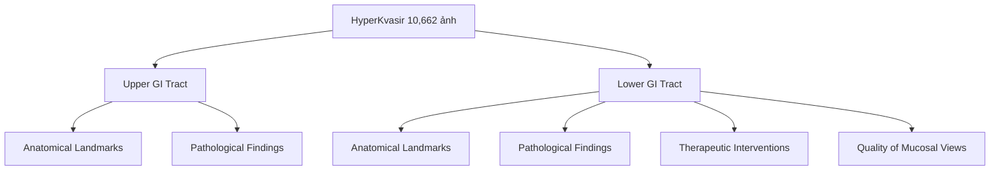

# Báo cáo Cấu trúc Phân cấp Thư mục Bộ dữ liệu HyperKvasir

> **Tổng số ảnh:** 10,662 ảnh | **Tổng số lớp:** 23 lớp
> **Nguồn:** Simula Research Laboratory & Bærum Hospital (Norway)

---

## 1. Bảng Thống kê Phân cấp Chi tiết 23 Lớp

| STT | Phân vùng (Tract) | Nhóm (Category) | Tên lớp (Class Name) | Số lượng ảnh | Tỷ lệ (%) |
|:---:|:---|:---|:---|:---:|:---:|
| 1 | `lower-gi-tract` | `anatomical-landmarks` | **cecum** | 1,009 | 9.46% |
| 2 | `lower-gi-tract` | `anatomical-landmarks` | **ileum** | 9 | 0.08% |
| 3 | `lower-gi-tract` | `anatomical-landmarks` | **retroflex-rectum** | 391 | 3.67% |
| 4 | `lower-gi-tract` | `pathological-findings` | **hemorrhoids** | 6 | 0.06% |
| 5 | `lower-gi-tract` | `pathological-findings` | **polyps** | 1,028 | 9.64% |
| 6 | `lower-gi-tract` | `pathological-findings` | **ulcerative-colitis-grade-0-1** | 35 | 0.33% |
| 7 | `lower-gi-tract` | `pathological-findings` | **ulcerative-colitis-grade-1** | 201 | 1.89% |
| 8 | `lower-gi-tract` | `pathological-findings` | **ulcerative-colitis-grade-1-2** | 11 | 0.10% |
| 9 | `lower-gi-tract` | `pathological-findings` | **ulcerative-colitis-grade-2** | 443 | 4.15% |
| 10 | `lower-gi-tract` | `pathological-findings` | **ulcerative-colitis-grade-2-3** | 28 | 0.26% |
| 11 | `lower-gi-tract` | `pathological-findings` | **ulcerative-colitis-grade-3** | 133 | 1.25% |
| 12 | `lower-gi-tract` | `quality-of-mucosal-views` | **bbps-0-1** | 646 | 6.06% |
| 13 | `lower-gi-tract` | `quality-of-mucosal-views` | **bbps-2-3** | 1,148 | 10.77% |
| 14 | `lower-gi-tract` | `quality-of-mucosal-views` | **impacted-stool** | 131 | 1.23% |
| 15 | `lower-gi-tract` | `therapeutic-interventions` | **dyed-lifted-polyps** | 1,002 | 9.40% |
| 16 | `lower-gi-tract` | `therapeutic-interventions` | **dyed-resection-margins** | 989 | 9.28% |
| 17 | `upper-gi-tract` | `anatomical-landmarks` | **pylorus** | 999 | 9.37% |
| 18 | `upper-gi-tract` | `anatomical-landmarks` | **retroflex-stomach** | 764 | 7.17% |
| 19 | `upper-gi-tract` | `anatomical-landmarks` | **z-line** | 932 | 8.74% |
| 20 | `upper-gi-tract` | `pathological-findings` | **barretts** | 41 | 0.38% |
| 21 | `upper-gi-tract` | `pathological-findings` | **barretts-short-segment** | 53 | 0.50% |
| 22 | `upper-gi-tract` | `pathological-findings` | **esophagitis-a** | 403 | 3.78% |
| 23 | `upper-gi-tract` | `pathological-findings` | **esophagitis-b-d** | 260 | 2.44% |

| | **TỔNG CỘNG** | | | **10,662** | **100.00%** |

---

## 2. Sơ đồ Cây Phân cấp (Mermaid Hierarchy Diagram)

